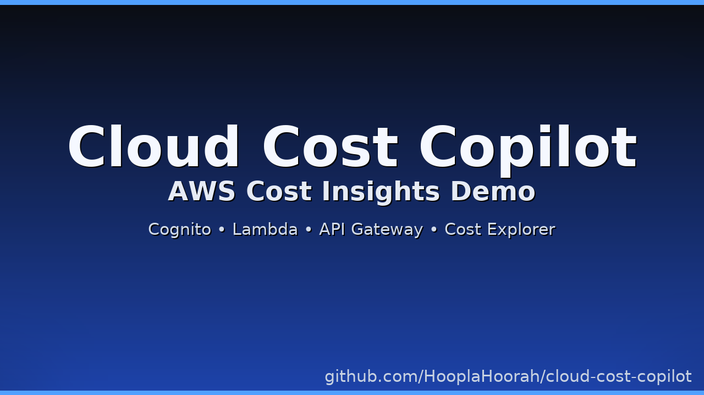
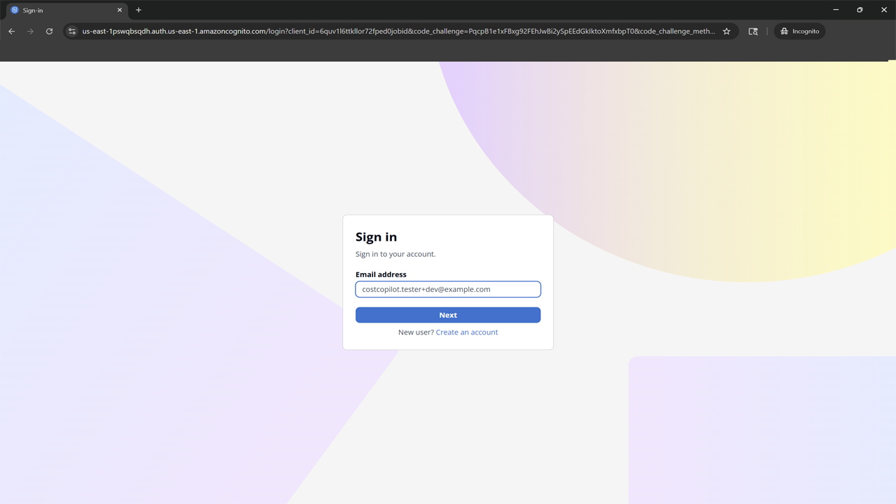
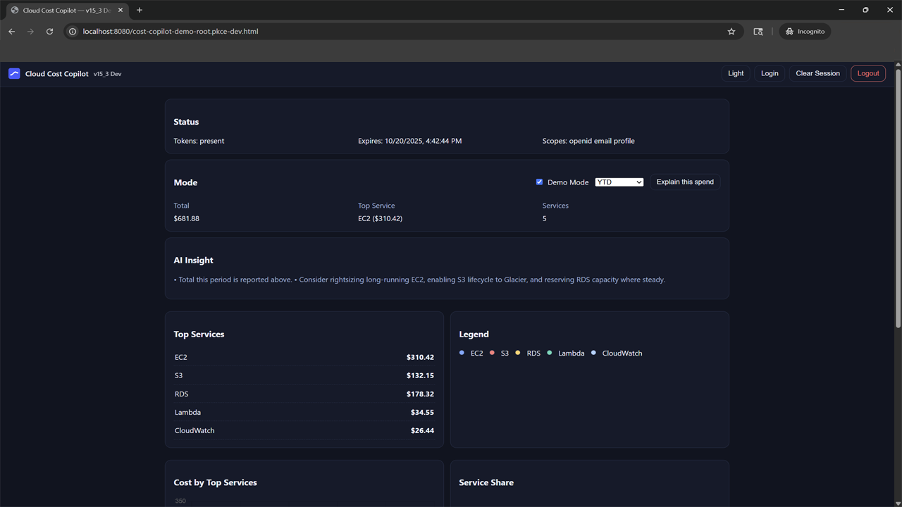
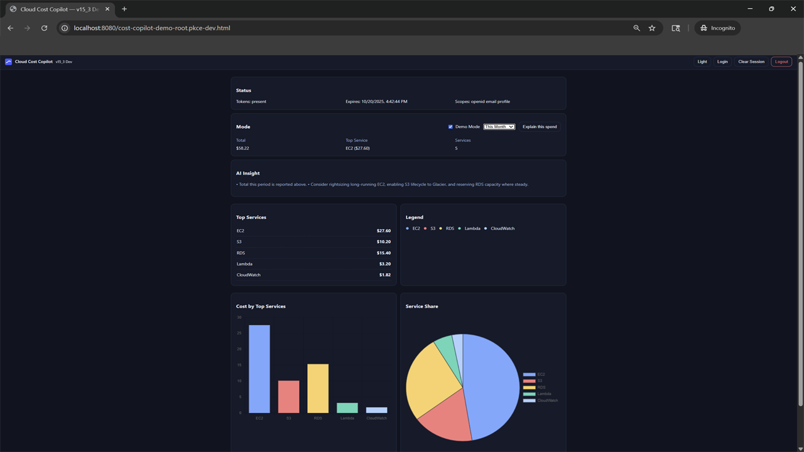
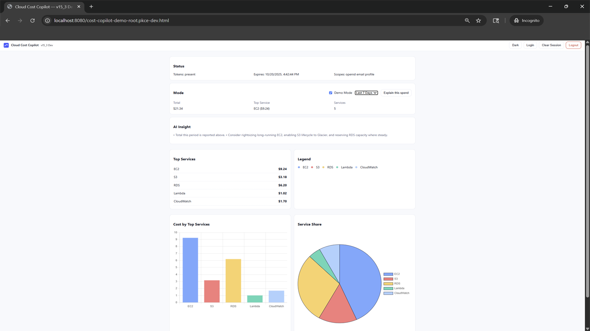
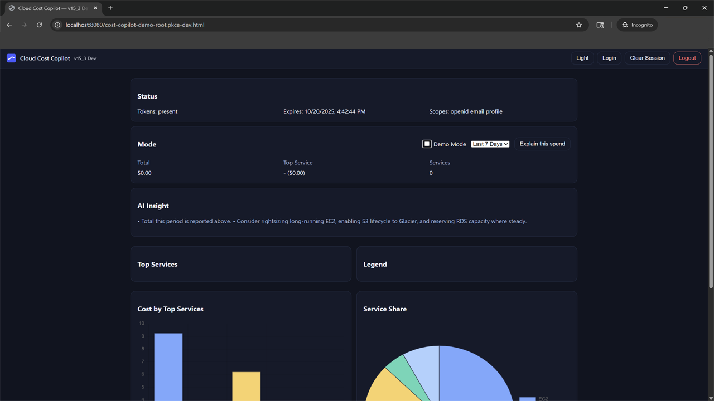
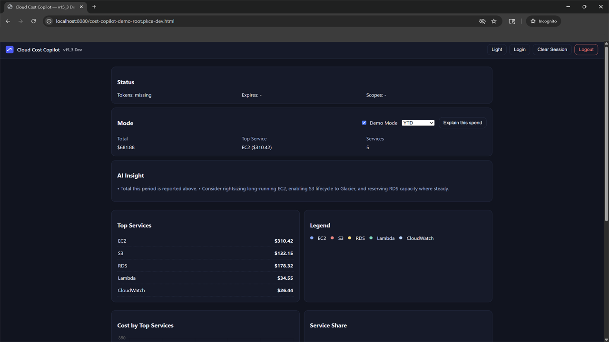

# Cloud Cost Copilot

[▶ Watch the 2‑minute demo on YouTube](https://youtu.be/sAfVSziJseU)

[](https://youtu.be/sAfVSziJseU)

Conversational, AWS-native cost insights. Secure PKCE login with Amazon Cognito, AWS Cost Explorer for truth, and optional Bedrock summaries. Works instantly in **Demo Mode** for new/empty accounts.

## Quick Links
- **YouTube demo:** https://youtu.be/sAfVSziJseU
- **Screenshots:** [`docs/screenshots/`](docs/screenshots/)
- **Generic client (placeholders):** `client/generic/`
- **Contributing / Changelog / Security:** see footer

## Quick Start (Local Demo)
1. Serve the client:
   ```bash
   cd client/generic
   python -m http.server 8080
   ```
2. Open: <http://localhost:8080/cost-copilot-demo-root.pkce-dev.html>
3. Click **Login** (uses your Cognito config) or toggle **Demo Mode** for a full walkthrough.

## Wire It Up To Your AWS (Cognito PKCE)
Edit `client/generic/config.js` and replace placeholders:
```js
window.CFG = {
  userPoolDomain: "https://<your-domain>.auth.<region>.amazoncognito.com",
  clientId: "<your-app-client-id>",
  redirectUri: "http://localhost:8080/cost-copilot-demo-root.pkce-dev.html",
  signOutRedirectUri: "http://localhost:8080/cost-copilot-demo-root.pkce-dev.html",
  scopes: ["openid","email","profile"]
};
```
Ensure these two URLs are in your Cognito App client's **Allowed callback URLs** and **Allowed sign-out URLs**.

## Backend (Optional)
If you want live data instead of Demo Mode:
- API Gateway → Lambda (orchestrator) with policies in `backend/iam-policies/`.
- Enable **AWS Cost Explorer** in the account.
- Set `API_BASE_URL` in your client to call the API (if included in your build).

## Repo Layout
```
/ (repo root)
├─ README.md
├─ DEVPOST.md
├─ LICENSE
├─ backend/
│  └─ iam-policies/
├─ client/
│  └─ generic/
│     ├─ config.js
│     ├─ token-ui.js
│     ├─ dashboard.js, styles.css, assets/, demo-data/
│     └─ README-GENERIC.md
└─ docs/
   ├─ screenshots/
   ├─ thumbnail/
   │  ├─ yt_thumb_cloud_cost_copilot.png
   │  ├─ square_thumb_dark.png
   │  └─ square_thumb_light.png
   └─ video/
      ├─ captions_en.srt
      └─ demo_script.md
```

## Screenshots

**00 – Startup / Pre-Login**  


**01 – Login (PKCE Flow)**  


**02 – Token Panel (Post-Login)**  


**03 – Dashboard (Dark Mode)**  


**04 – Dashboard (Light Mode)**  


**05 – Zero-Spend View**  


**06 – Logout / End of Session**  


## Architecture
```mermaid
flowchart LR
A[Browser SPA] -->|PKCE| B[Cognito Hosted UI]
A -->|REST| C[API Gateway]
C --> D[Lambda Orchestrator]
D --> E[AWS Cost Explorer]
D --> F[Amazon Bedrock (optional)]
```

## Judging Notes
- **Runs offline** in Demo Mode (judge-friendly).
- **No secrets committed.** Everything configurable via `client/generic/config.js`.
- **Accessible** UI with light/dark mode, shared legend, zero-spend states.

---

## Project Meta
- **Contributing:** see [CONTRIBUTING.md](CONTRIBUTING.md)  
- **Changelog:** see [CHANGELOG.md](CHANGELOG.md)  
- **Security policy:** see [SECURITY.md](SECURITY.md)  
- **License:** [MIT](LICENSE)